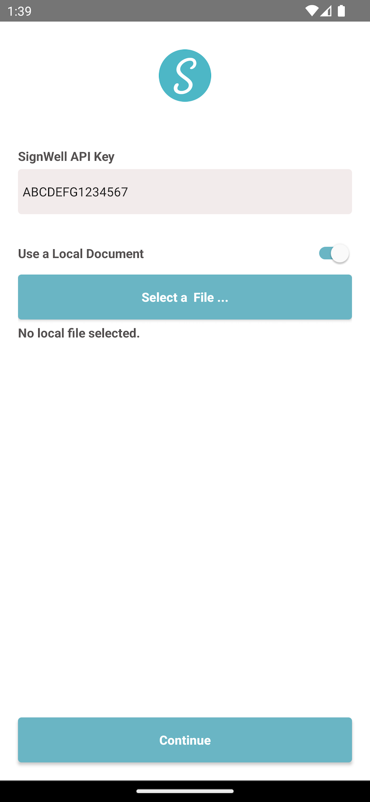
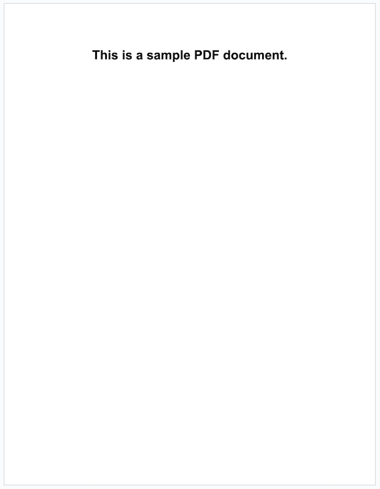
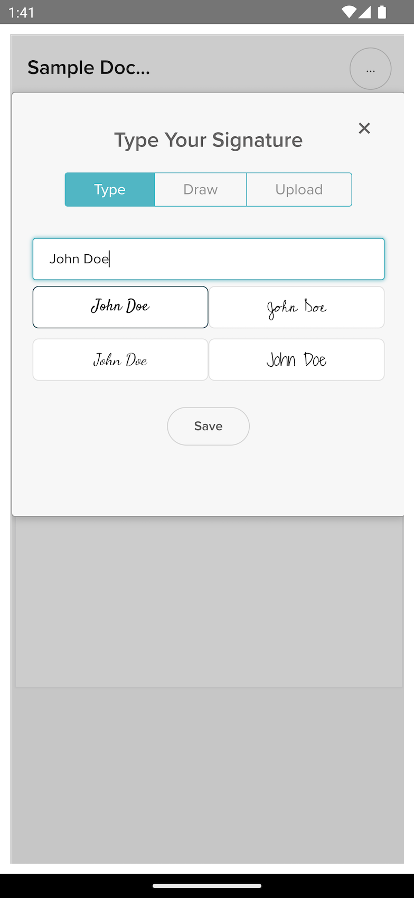

# SignWell Android Demo

## Introduction

This project demonstrates how to integrate the [SignWell](https://signwell.com) document signing functionality into your native Android app.

You will find a fully-functional sample Android app, written in Java, in the **sample_project** directory.

This document describes the implementation of the sample project, and provides a comprehensive overview of what's available to you while integrating SignWell into your own Android apps.  

## The Sample Android project

The sample project included in **sample_project** is an example integration of SignWell functionality in a native Android app.

The project implements the [SignWell embedding API](https://developers.signwell.com/reference/embedded-signing), and demonstrates how to embed the SignWell JavaScript widget into a native Android app, allowing the user to electronically sign a document.

The app does this in two steps:

1. Creates a SignWell document from either a local file, or from a specified URL.
2. Presents that document for the user to sign.

### Your SignWell API key

Prior to building and running the app, you can specify your SignWell API key in **Common.java**

`final static String SIGNWELL_API_KEY = "";`

You can find your SignWell API key in the [settings section of your SignWell account](https://www.signwell.com/app/settings/api).

In the app, this API key appears in an editable `EditText`, so you can change it at runtime as needed. You can find this code in the **HomeScreen** class.

### Selecting a document source

After specifying the API key, the next step is to decide whether to use a local file or a URL for the source document. 

This depends on the needs of your application. If you're allowing your users to select and sign a document from their device, or if you're bundling a document with your application, you can choose to use a local document for signing. If you're providing documents from a server, you can choose to use a document URL as the source.

The SignWell API supports both options, and the sample project allow you to either select a local file, or to enter a URL of a remote file.

If you need a sample PDF document to use for testing, you can grab one [here](./github_resources/sample_document.pdf).

You can either download this onto your Android device, for testing the local file upload functionality, or upload it to a server to test the remote URL functionality.

### Creating the SignWell document

To create a document, we use the [documents](https://developers.signwell.com/reference/post_api-v1-documents) endpoint of the SignWell embedding API.

#### The request

For API authentication, our API key is passed in as the value for the `X-Api-Key` header, in every request sent to the SignWell API. In the sample project, you can find this in the `post` method of the **APIRequest** class.

The sample project uses the popular [OkHttp](https://square.github.io/okhttp/) networking library to make API calls. Of course, you are free to use whatever method works best for you.

Note that with **OkHttp**, when creating a JSON body as part of the request, we set the media type parameter to **null** instead of `MediaType.parse("application/json")`, like this:

`RequestBody requestBody = RequestBody.create(new JSONObject(params).toString(), null);`

The reason for this is because, when we set the media type in the second parameter, **OkHttp** automatically appends the suffix **;charset=utf-8** to the **"Content-Type"** header, resulting in the full header being **"application/json; charset=utf-8"**. The SignWell API currently has an issue parsing a header in this format. As a workaround, we set the media type parameter to **null**, and then specify the **"Content-Type"** header manually, like this:

`.addHeader("Content-Type", "application/json")`

The **CreateDocumentRequest** class populates all of the required and some of the optional fields of the **documents** endpoint. While you can refer to the specifics in the source code and the [SignWell API documentation](https://developers.signwell.com/reference/post_api-v1-documents), we will cover some of the notable ones here.

	{
		"test_mode": true
	}	

Setting `test_mode` to true allows us to test the app without the calls counting against our API billing.

	{
		"files": [
			{
				"name": "file_1.pdf"
				"file_base64": _fileBase64
			},
		],
	}

or ...

	{
		"files": [
			{
				"name": "file_1.pdf"
				"file_url": "https://someserver.com/somefile.pdf"
			},
		],
	}
	
The `files` parameter allows us to pass in multiple source documents from which to create a SignWell document. 

In the sample project, we only provide one source file. If we chose to use a locally-selected file, we pass in the base64-encoded file data as the `file_base64` parameter to the API. If we chose to use a remote URL for the source document, we pass that URL into the `file_url` parameter instead.

	
	{
		"recipients": [
	        {
	            "id" : "1",
	            "name": "John Doe",
	            "email": "user@host.com"
	        },
	    ],
	}
	
Note that, with Android's `Base64.encodeToString(...)` method, we need to specify **Base64.NOWRAP** as the style of encoding, instead of **Base64.DEFAULT**, to work properly with the SignWell API.

The `recipients` array specifies a list of people that must complete and/or sign the document. The SignWell API provides a multitude of options on how to specify these recipients. In the sample project, we just provide an identifier, a name, and an email address of a single placeholder recipient.

	{
		"fields": [[
		    {
		        "x": 200,
		        "y": 550,
		        "page": 1,
		        "recipient_id": "1",
		        "required": true,
		        "type": "signature",
		    },
		    {
		        "x": 110,
		        "y": 550,
		        "page": 1,
		        "recipient_id": "1",
		        "required": true,
		        "type": "date",
		        "date_format": "Month DD, YYYY",
		        "lock_sign_date": false
		    },
		]], 
	}
	
The `fields` parameter defines the fields to be placed in the document, for collecting data or signatures from the recipient. 	

In the sample project, we request that two fields be placed in the document; a **signature** field, and a **date** field. Both fields are marked as **required**, and the recipient we defined earlier is specified here as the target recipient from whom we will collect the data. We also specify the placement position, in the resulting document, for each field. 

Once again, the [SignWell API](https://developers.signwell.com/reference/post_api-v1-documents) provides a multitude of options when defining the presentation and behavior of the data fields.

### The response

Once **CreateDocumentRequest** makes a POST API call to the [documents](https://developers.signwell.com/reference/post_api-v1-documents) endpoint, the SignWell API returns some data. In the sample project, the response is handled in the **CreateDocumentResponse** class. 

In the API response, the data we're looking for is in the `embedding_signing_url` field. In the response data, the `embedding_signing_url` field is contained within each of the items of the `recipients` array. The **CreateDocumentResponse** class contains example code that parses out the data we need.

Once we have the `embedding_signing_url` (the **signing URL**), we are ready to present the document for signing.

### Presenting the Document

To present the document to the user, we will be using a standard `WebView`. We provide the `WebView` with the **signing URL** (`embedding_signing_url`), which we obtained from the response to the SignWell API call.

In the sample project, all of this is done in the **WebViewScreen** class.

#### Rendering the document

We're not actually going to tell the `WebView` to render the **signing URL** directly. 

Instead, we're going to load a pre-made HTML page, containing some boilerplate HTML code, and a JavaScript snippet that makes another call to the SignWell API, asking it to render the document for us.

In the project, this HTML page is included as **page.html** in the **app/src/main/assets** directory.

We will go over the contents of the HTML page here.

	<!DOCTYPE html>
	<html>
	    <head>
	        <title>SignWell Android Demo</title>
	        
	    </head>
	
	    <body>
	        
	    </body>
	</html>

First, the `<script>` tag in the `<head>` section, at the top of the HTML page, loads the SignWell JavaScript snippet, which is responsible for all the heavy-lifting of rendering the document and providing the user with the controls needed to sign and fill-out the various data fields.

The `<body>` section of the document contains the main JavaScript snippet, which tells the SignWell snippet what to do. Let's quickly look at this ...

	url: '$SIGNING_URL$',

The url param tells the SignWell widget which document to render. The `'$SIGNING_URL$'` token is a placeholder which we will replace with the **signing URL** we got back earier from the SignWell API.

	events: {
   		completed: e => {
      		AndroidApp.onSigningComplete();
		}
	}

The events object contains various callbacks that may be useful to you. The only one used in the sample project right now is the `completed` callback, which is called when the user finished signing the document and filling out all the required data fields. The callback uses the WebView JavaScript interface to send the 'completed' notification from JavaScript land back to our Android Java code in **WebViewScreen**, so we can deal with that event as needed.

#### WebView

Before we load the HTML page into the WebView, we need to set things up properly. Again, in the sample project, this is all done in **WebViewScreen**.

First, because our HTML page makes use of the SignWell JavaScript widget, we configure the WebView to allow JavaScript.

	WebSettings webSettings = _webView.getSettings();
	webSettings.setJavaScriptEnabled(true);

Then, because we want to receive that notification when the user has completed signing the document, we set up a JavaScript interface that will allow JavaScript to call our Android Java methods.

`_webView.addJavascriptInterface(this, "AndroidApp");`

Next, we get the bundled HTML page that we're going to be using.

`String html = readTextFileFromAssets("page.html").replace("$SIGNING_URL$", signingURL);`

And, as mentioned above, we replace the `$SIGNING_URL$` token in that HTML page with the **signing URL** that we got back from our earlier SignWell API call. The JavaScript snippet in the HTML page will tell SignWell that this is the URL of the document we want rendered for signing.

`htmlString = htmlString.replacingOccurrences(of: "$SIGNING_URL$", with: _signingURL);`

 And finally, we load the HTML page into the `WebView`.
 
 `_webView.loadData(html, "text/html", "UTF-8");`

    
    
Because the `onSigningComplete` method in **WebViewScreen** is marked with `@JavascriptInterface`, and we configured our `WebView` to be able to call Java methods from JavaScript, the `onSigningComplete ` method gets called when the user has finished signing the document. In the sample project, we just show an alert dialog to the user, confirming that the document has been signed, and we close the screen that displayed the document.
